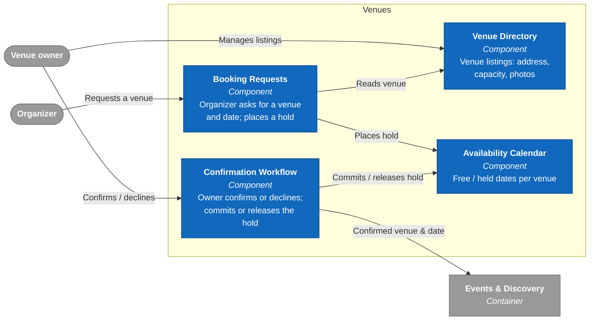
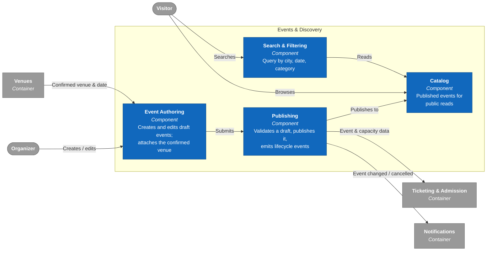
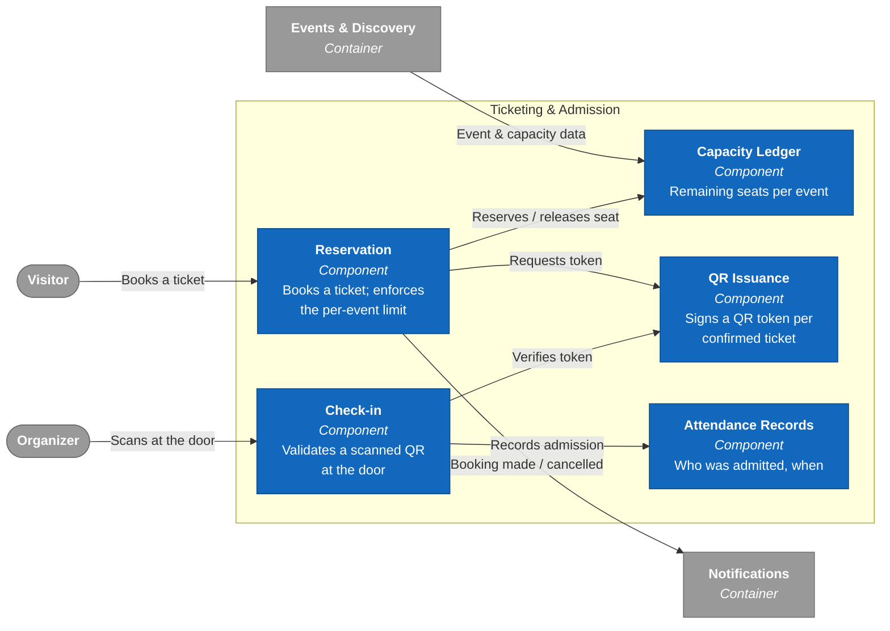
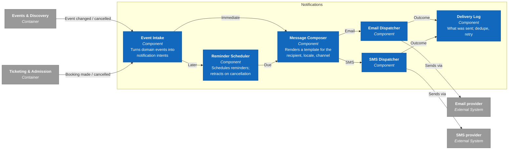
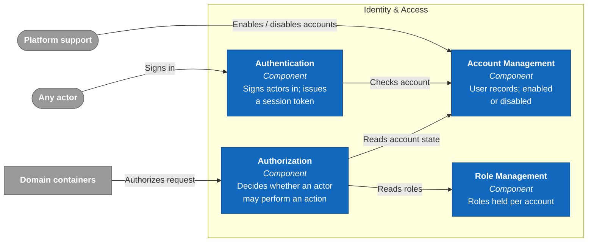

# C4: Component

Zooms into each domain container from [c4-container.md](c4-container.md).
Grey nodes are outside the container in focus.

## Venues

## Events & Discovery

## Ticketing & Admission

## Notifications

## Identity & Access

