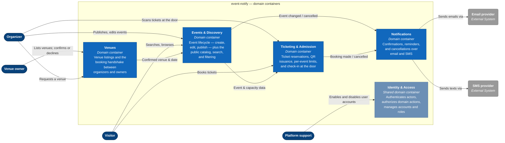

# C4: Container

Zooms into event-notify to show its domain containers and how they communicate.
Each container owns a whole domain; its functions are shown one level down, at the
component level.

> The `c4-container.png` bitmap is regenerated from the Mermaid source below.

Mermaid source

