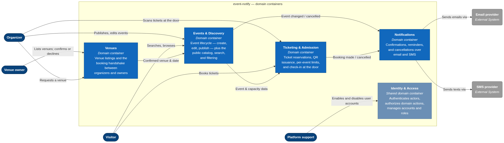
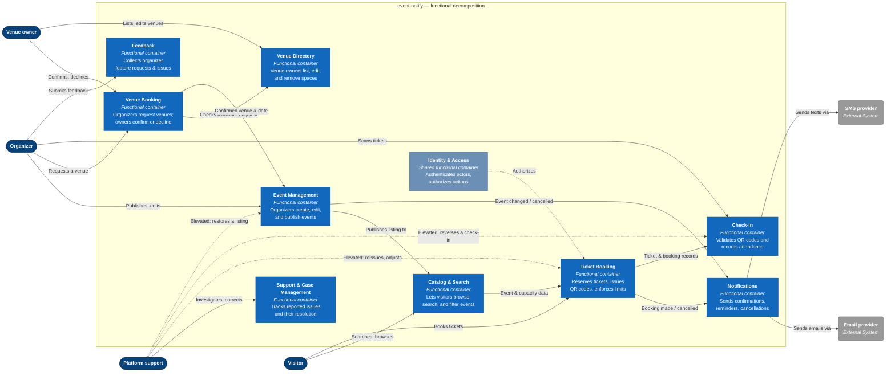

# C4: Container

Zooms into event-notify to show its major deployable pieces (containers), and how they communicate.

Mermaid source

```mermaid
flowchart LR
 subgraph boundary["event-notify — functional decomposition"]
        catalog["<b>Catalog & Search</b><br><i>Functional container</i><br>Lets visitors browse,<br>search, and filter events"]
        eventMgmt["<b>Event Management</b><br><i>Functional container</i><br>Organizers create, edit,<br>and publish events"]
        venueDirectory["<b>Venue Directory</b><br><i>Functional container</i><br>Venue owners list, edit,<br>and remove spaces"]
        venueBooking["<b>Venue Booking</b><br><i>Functional container</i><br>Organizers request venues;<br>owners confirm or decline"]
        ticketBooking["<b>Ticket Booking</b><br><i>Functional container</i><br>Reserves tickets, issues<br>QR codes, enforces limits"]
        checkin["<b>Check-in</b><br><i>Functional container</i><br>Validates QR codes and<br>records attendance"]
        notifications["<b>Notifications</b><br><i>Functional container</i><br>Sends confirmations,<br>reminders, cancellations"]
        caseMgmt["<b>Support & Case Management</b><br><i>Functional container</i><br>Tracks reported issues<br>and their resolution"]
        feedback["<b>Feedback</b><br><i>Functional container</i><br>Collects organizer<br>feature requests & issues"]
        identity["<b>Identity & Access</b><br><i>Shared functional container</i><br>Authenticates actors,<br>authorizes actions"]
 end
    visitor(["<b>Visitor</b>"]) -- Searches, browses --> catalog
    visitor -- Books tickets --> ticketBooking
    organizer(["<b>Organizer</b>"]) -- Publishes, edits --> eventMgmt
    organizer -- Requests a venue --> venueBooking
    organizer -- Scans tickets --> checkin
    organizer -- Submits feedback --> feedback
    venueOwner(["<b>Venue owner</b>"]) -- Confirms, declines --> venueBooking
    venueOwner -- Lists, edits venues --> venueDirectory
    supportPerson(["<b>Platform support</b>"]) -- Investigates, corrects --> caseMgmt

    eventMgmt -- Publishes listing to --> catalog
    venueBooking -- Checks availability against --> venueDirectory
    venueBooking -- Confirmed venue & date --> eventMgmt
    catalog -- Event & capacity data --> ticketBooking
    ticketBooking -- Booking made / cancelled --> notifications
    eventMgmt -- Event changed / cancelled --> notifications
    ticketBooking -- Ticket & booking records --> checkin
    supportPerson -. Elevated: reissues, adjusts .-> ticketBooking
    supportPerson -. Elevated: reverses a check-in .-> checkin
    supportPerson -. Elevated: restores a listing .-> eventMgmt
    identity -.Authorizes.-> ticketBooking

    notifications -- Sends emails via --> emailProvider["<b>Email provider</b><br><i>External System</i>"]
    notifications -- Sends texts via --> smsProvider["<b>SMS provider</b><br><i>External System</i>"]

    emailProvider@{ shape: rounded}
    smsProvider@{ shape: rounded}
     catalog:::container
     eventMgmt:::container
     venueDirectory:::container
     venueBooking:::container
     ticketBooking:::container
     checkin:::container
     notifications:::container
     caseMgmt:::container
     feedback:::container
     identity:::shared
     visitor:::person
     organizer:::person
     venueOwner:::person
     supportPerson:::person
     emailProvider:::external
     smsProvider:::external
    classDef person fill:#08427b,stroke:#052e56,color:#fff
    classDef container fill:#1168bd,stroke:#0b4884,color:#fff
    classDef shared fill:#6b8fb5,stroke:#4a6e95,color:#fff
    classDef external fill:#999999,stroke:#6b6b6b,color:#fff
```

