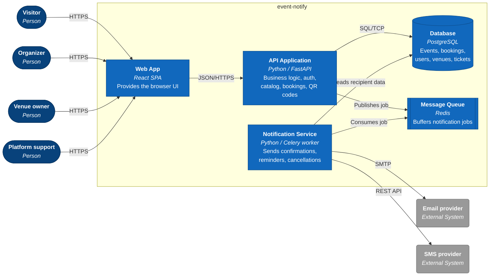

# C4: Container

Zooms into event-notify to show its major deployable pieces (containers), their technology choices, and how they communicate.

```mermaid
flowchart LR
 subgraph boundary["event-notify"]
    direction LR
        webApp["<b>Web App</b><br><i>React SPA</i><br>Provides the browser UI"]
        api["<b>API Application</b><br><i>Python / FastAPI</i><br>Business logic, auth,<br>catalog, bookings, QR codes"]
        db[("<b>Database</b><br><i>PostgreSQL</i><br>Events, bookings,<br>users, venues, tickets")]
        queue[["<b>Message Queue</b><br><i>Redis</i><br>Buffers notification jobs"]]
        notifSvc["<b>Notification Service</b><br><i>Python / Celery worker</i><br>Sends confirmations,<br>reminders, cancellations"]
  end
    visitor(["<b>Visitor</b><br><i>Person</i>"]) -- HTTPS --> webApp
    organizer(["<b>Organizer</b><br><i>Person</i>"]) -- HTTPS --> webApp
    venueOwner(["<b>Venue owner</b><br><i>Person</i>"]) -- HTTPS --> webApp
    support(["<b>Platform support</b><br><i>Person</i>"]) -- HTTPS --> webApp
    webApp -- JSON/HTTPS --> api
    api -- SQL/TCP --> db
    api -- Publishes job --> queue
    notifSvc -- Consumes job --> queue
    notifSvc -- Reads recipient data --> db
    notifSvc -- SMTP --> emailProvider["<b>Email provider</b><br><i>External System</i>"]
    notifSvc -- REST API --> smsProvider["<b>SMS provider</b><br><i>External System</i>"]

    emailProvider@{ shape: rounded}
    smsProvider@{ shape: rounded}
     webApp:::container
     api:::container
     db:::container
     queue:::container
     notifSvc:::container
     visitor:::person
     organizer:::person
     venueOwner:::person
     support:::person
     emailProvider:::external
     smsProvider:::external
    classDef person fill:#08427b,stroke:#052e56,color:#fff
    classDef container fill:#1168bd,stroke:#0b4884,color:#fff
    classDef external fill:#999999,stroke:#6b6b6b,color:#fff
```
