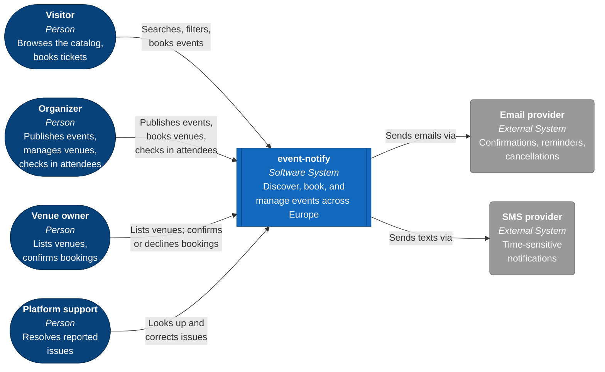

# C4: System Context

Shows event-notify as a single system, the people who use it, and the external systems it depends on.

```mermaid
flowchart LR
    visitor(["<b>Visitor</b><br><i>Person</i><br>Browses the catalog,<br>books tickets"]) -- Searches, filters,<br>books events --> eventNotify[["<b>event-notify</b><br><i>Software System</i><br>Discover, book, and<br>manage events across Europe"]]
    organizer(["<b>Organizer</b><br><i>Person</i><br>Publishes events,<br>manages venues,<br>checks in attendees"]) -- Publishes events,<br>books venues,<br>checks in attendees --> eventNotify
    venueOwner(["<b>Venue owner</b><br><i>Person</i><br>Lists venues,<br>confirms bookings"]) -- Lists venues; confirms<br>or declines bookings --> eventNotify
    support(["<b>Platform support</b><br><i>Person</i><br>Resolves reported<br>issues"]) -- Looks up and<br>corrects issues --> eventNotify
    eventNotify -- Sends emails via --> emailProvider["<b>Email provider</b><br><i>External System</i><br>Confirmations, reminders,<br>cancellations"]
    eventNotify -- Sends texts via --> smsProvider["<b>SMS provider</b><br><i>External System</i><br>Time-sensitive<br>notifications"]

    emailProvider@{ shape: rounded}
    smsProvider@{ shape: rounded}
     visitor:::person
     eventNotify:::system
     organizer:::person
     venueOwner:::person
     support:::person
     emailProvider:::external
     smsProvider:::external
    classDef person fill:#08427b,stroke:#052e56,color:#fff
    classDef system fill:#1168bd,stroke:#0b4884,color:#fff
    classDef external fill:#999999,stroke:#6b6b6b,color:#fff
```
